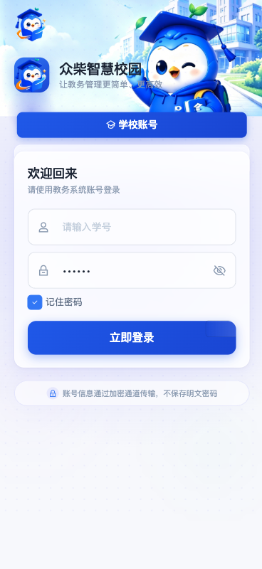
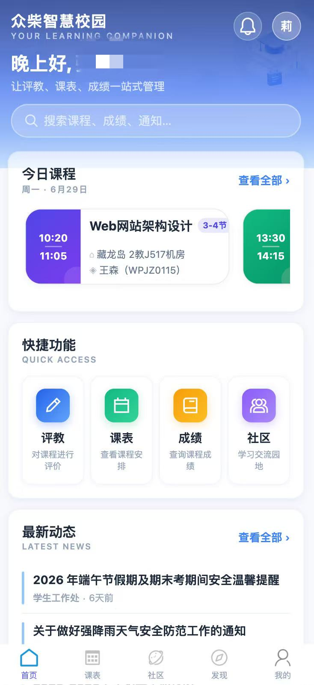
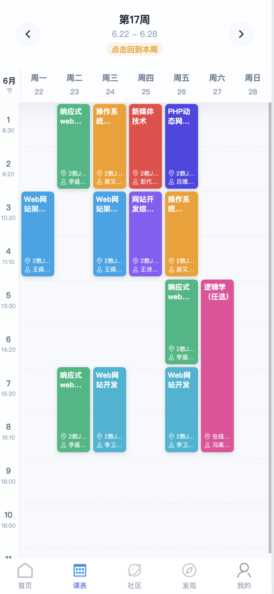
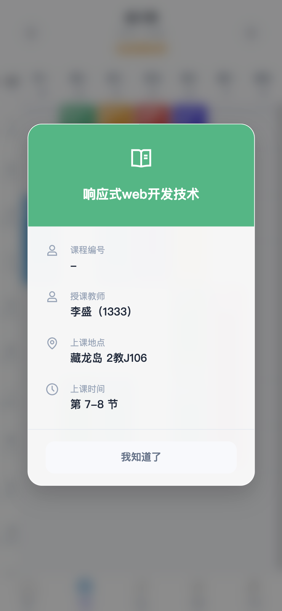
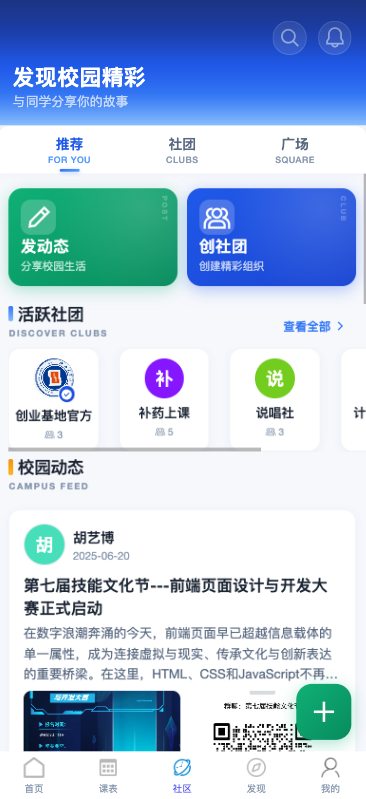
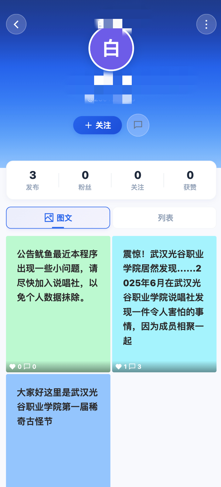
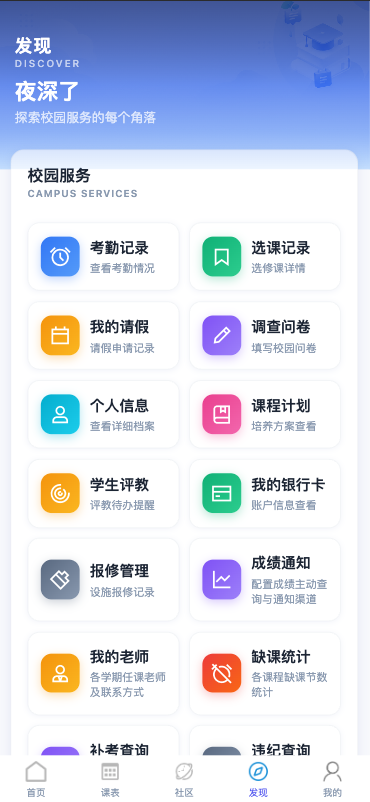
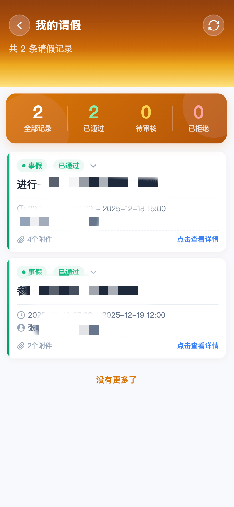
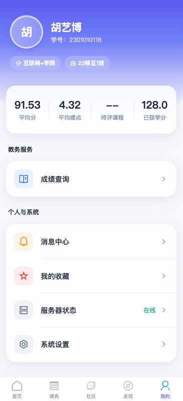

<div align="center">


# 众柴智慧校园系统

### 基于 uni-app + Go 的全栈智慧校园解决方案

> 第三方武汉光谷职业院校教务学生端 · 非官方服务

<p>
  <a href="https://github.com/dcloudio/uni-app"></a>
  <a href="https://github.com/golang/go"></a>
  <a href="#"></a>
  <a href="./LICENSE"></a>
  <a href="https://github.com/imxiaohu/zhongchai_whggvc/pulls"></a>
  <a href="https://github.com/imxiaohu/zhongchai_whggvc/stargazers"></a>
  <a href="https://github.com/imxiaohu/zhongchai_whggvc/network/members"></a>
  <a href="https://github.com/imxiaohu/zhongchai_whggvc/commits"></a>
</p>


<br />

<p>
  <a href="https://whggvc.imxiaohu.cn"><strong>在线预览</strong></a> ·
  <a href="#-快速开始"><strong>快速开始</strong></a> ·
  <a href="#-项目架构"><strong>项目架构</strong></a> ·
  <a href="#-部署指南"><strong>部署指南</strong></a> ·
  <a href="#-贡献指南"><strong>贡献指南</strong></a>
</p>

</div>

---

## 📑 目录

- [✨ 功能模块](#-功能模块)
- [🖼 界面预览](#-界面预览)
- [🛠 技术栈](#-技术栈)
- [🏗 项目架构](#-项目架构)
- [💎 功能特色](#-功能特色)
- [📂 项目结构](#-项目结构)
- [🚀 快速开始](#-快速开始)
- [📦 部署指南](#-部署指南)
- [⚙️ GitHub Actions CI/CD](#%EF%B8%8F-github-actions-cicd)
- [🔧 配置说明](#-配置说明)
- [📚 文档](#-文档)
- [⚠️ 免责声明](#%EF%B8%8F-免责声明)
- [🤝 贡献指南](#-贡献指南)
- [📄 许可证](#-许可证)
- [🙏 致谢](#-致谢)

---

## ✨ 功能模块

<table>
<tr>
<td width="50%" valign="top">

### 🏠 首页
- 评教入口
- 成绩查询入口
- 今日课程、新闻资讯
- 教务服务快捷入口

### 📝 评教系统
- 课程评教
- 教师评教
- 评价统计
- 历史记录

### 👥 校园社区【非官方】
- 发帖评论、点赞收藏
- 举报屏蔽机制
- 社团创建与管理
- 用户主页与关注列表

</td>
<td width="50%" valign="top">

### 📅 课程管理
- 课表查看（周视图）
- 课程详情
- 今日课程

### 🎓 综合教务
- 实习管理、请假销假
- 档案编辑、培养计划
- 银行卡、补考补修
- 成绩订阅、PC 端登录

### 🙋 用户中心【非官方】
- 个人信息、消息通知
- 成绩管理、同步设置
- 短信充值、关于

### 📰 校园资讯
- 新闻公告、详情浏览

</td>
</tr>
</table>

---

## 🖼 界面预览

<p align="center">
  
  
</p>

<p align="center">
  
  
</p>

<p align="center">
  
  
</p>

<p align="center">
  
  
</p>

<p align="center">
  
</p>

---

## 🛠 技术栈

### Frontend · 移动端

<table>
<tr>
<th>技术</th>
<th>说明</th>
</tr>
<tr>
<td><a href="https://github.com/dcloudio/uni-app"><b>uni-app</b></a></td>
<td>跨平台应用框架 (Vue 3)</td>
</tr>
<tr>
<td><a href="https://github.com/vuejs/pinia"><b>Pinia</b></a></td>
<td>Vue 官方推荐状态管理</td>
</tr>
<tr>
<td><a href="https://github.com/intlify/vue-i18n"><b>vue-i18n</b></a></td>
<td>国际化方案（9.1.9）</td>
</tr>
<tr>
<td><a href="https://github.com/Tencent/tdesign-uni"><b>TDesign</b></a></td>
<td>腾讯企业级 UI 组件库</td>
</tr>
<tr>
<td><a href="https://github.com/unocss/unocss"><b>UnoCSS</b></a></td>
<td>原子化 CSS 引擎</td>
</tr>
<tr>
<td><b>SCSS</b></td>
<td>样式预处理</td>
</tr>
</table>

### Backend · 服务端

<table>
<tr>
<th>技术</th>
<th>说明</th>
</tr>
<tr>
<td><a href="https://github.com/golang/go"><b>Go</b></a></td>
<td>高性能 API 服务（1.21+）</td>
</tr>
<tr>
<td><b>Gin</b></td>
<td>HTTP Web 框架</td>
</tr>
<tr>
<td><b>GORM</b></td>
<td>ORM 数据访问层</td>
</tr>
<tr>
<td><b>MySQL</b></td>
<td>关系型数据库（主存储）</td>
</tr>
<tr>
<td><b>Redis</b></td>
<td>缓存与会话存储</td>
</tr>
<tr>
<td><b>RabbitMQ</b></td>
<td>消息队列（异步通知）</td>
</tr>
<tr>
<td><b>JWT</b></td>
<td>无状态身份认证</td>
</tr>
</table>

---

## 🏗 项目架构

### 系统架构图

```
+-------------------------------------------------------------------------+
|                         客户端层 (Client Layer)                          |
|  +-----------+  +-----------+  +-----------+  +-----------+              |
|  | 微信小程序 |  |  H5 网页  |  |Android App|  |  iOS App  |              |
|  +-----+-----+  +-----+-----+  +-----+-----+  +-----+-----+              |
+-------------------------------------------------------------------------+
      |              |              |              |
      v              v              v              v
+-------------------------------------------------------------------------+
|                  接入层 (uni-app Vue 3 + Pinia)                          |
|  +-------------+  +-------------+  +-------------+                      |
|  |  TDesign    |  |   UnoCSS    |  |  vue-i18n   |                      |
|  |  组件库     |  |  原子化样式  |  |   国际化     |                      |
|  +-------------+  +-------------+  +-------------+                      |
+-------------------------------------------------------------------------+
                          |  HTTPS / JWT Auth
                          v
+-------------------------------------------------------------------------+
|                    API 网关层 (Go Gin Framework)                          |
|                                                                          |
|  +----------+  +----------+  +----------+  +----------+  +----------+    |
|  |   CORS   |  |   JWT    |  |  Logger  |  | Smart    |  | RateLimit|   |
|  |  中间件  |  |  认证    |  |  日志    |  | Cache    |  |  限流    |    |
|  +----------+  +----------+  +----------+  +----------+  +----------+    |
|                                                                          |
|  +-----------------------------------------------------------------+     |
|  |                  控制器层 (Controllers)                           |     |
|  |  评教 | 社区 | 课程 | 成绩 | 通知 | 同步 | 文件上传 | 支付        |     |
|  +-----------------------------------------------------------------+     |
|  +-----------------------------------------------------------------+     |
|  |                  服务层 (Services)                                |     |
|  |  离线缓存 | 成绩检查 | 数据同步 | 智能缓存 | 多渠道通知          |     |
|  +-----------------------------------------------------------------+     |
|  +-----------------------------------------------------------------+     |
|  |                  模型层 (Models / ORM)                           |     |
|  |  GORM + MySQL | Redis | SQLite                                   |     |
|  +-----------------------------------------------------------------+     |
+-------------------------------------------------------------------------+
                          |
            +-------------+-------------+-------------+
            v             v             v             v
    +-----------+  +-----------+  +-----------+  +-----------+
    |   MySQL   |  |   Redis   |  | RabbitMQ  | |  SQLite   |
    |  主存储   |  |  缓存/会话 |  |  消息队列  | |  离线缓存  |
    +-----------+  +-----------+  +-----------+  +-----------+
                          |
                          v
+-------------------------------------------------------------------------+
|                  第三方服务 (Third-Party Services)                        |
|  +----------+  +----------+  +----------+  +----------+  +----------+   |
|  | 教务系统 |  | 微信支付 |  |  七牛云  |  | 钉钉/邮件 |  | ddddocr  |   |
|  |  (代理)  |  |          |  | 文件存储 |  |  短信     |  | 验证码   |   |
|  +----------+  +----------+  +----------+  +----------+  +----------+   |
+-------------------------------------------------------------------------+
```

### 模块依赖关系

```
                        +-----------------------+
                        |        main.go        |
                        |   应用入口 & 路由注册   |
                        +-----------+-----------+
                                    |
        +---------------------------+---------------------------+
        |                           |                           |
        v                           v                           v
+----------------+         +----------------+         +----------------+
|   middleware   |         |  controllers   |         |    services    |
|  - jwt.go      |         |  - auth_*      |         |  - sync_*      |
|  - logger.go   |         |  - community_* |         |  - score_*     |
|  - cache.go    |         |  - discover_*  |         |  - offline_*   |
|  - smart_cache |         |  - evaluation* |         |  - notification|
|                |         |  - course_*    |         |  - email_*     |
|                |         |  - post/comment|         |  - sms_*       |
|                |         |  - proxy_*     |         |  - dingtalk_*  |
+----------------+         +-------+--------+         +-------+--------+
                                   |                          |
                                   v                          v
                          +----------------+         +----------------+
                          |     models     |         |     config     |
                          |  - user.go     |         |  - config.go   |
                          |  - club.go     |         |  - templates   |
                          |  - community_* |         |  - timetable   |
                          |  - evaluation* |         +----------------+
                          |  - offline_*   |
                          +-------+--------+
                                  |
                  +---------------+---------------+
                  v               v               v
            +-----------+  +-----------+  +-----------+
            |   MySQL   |  |   Redis   |  | RabbitMQ  |
            +-----------+  +-----------+  +-----------+
```

---

## 💎 功能特色

### 🧠 智能缓存体系

| 特性 | 说明 |
|------|------|
| **智能缓存服务** | 自动识别高频数据，合理分配 Redis / MySQL 存储 |
| **离线缓存服务** | 支持断网时加载历史数据，提升弱网体验 |
| **批量成绩缓存** | 学期成绩预缓存，查询响应毫秒级 |
| **用户级同步缓存** | 课程表等数据按用户独立缓存，互不干扰 |

### 📣 多渠道通知系统

| 渠道 | 功能 |
|------|------|
| **邮件通知** | 成绩发布、评教提醒等邮件推送 |
| **短信通知** | 即时短信提醒，支持验证码发送 |
| **钉钉通知** | 企业群机器人推送，集成模板消息 |
| **应用内通知** | 实时消息中心，点赞 / 评论 / 收藏提醒 |
| **微信支付通知** | 短信充值到账通知 |

### 🌐 校园社区生态

- **非官方服务**，师生自由交流互动平台
- 支持图文帖子、层级评论、点赞收藏
- 社团创建与管理，社团帖子与成员管理
- 用户关注与主页，发现推荐内容
- 社区条款合规弹窗，内容审核机制

### 🎓 综合教务服务

一站式 PC + 移动端教务服务入口：

| 模块 | 功能覆盖 |
|------|----------|
| **实习管理** | 申请、岗位、要求、计划、签到、评分、总结、审核 |
| **请假销假** | 请假申请、销假管理、审批流程 |
| **档案管理** | 个人信息编辑、档案查询与修改 |
| **培养计划** | 培养方案查看、课程规划 |
| **成绩订阅** | 成绩发布订阅、推送通知 |
| **银行卡** | 银行卡绑定与管理 |
| **补考申请** | 补考科目申请与查询 |
| **补修申请** | 补修课程申请管理 |
| **缺勤记录** | 缺勤情况查看与申诉 |
| **我的老师** | 教师信息与联系方式 |
| **PC 端登录** | PC 教务系统快捷登录 |

### 🛡️ 高可用保障

| 机制 | 说明 |
|------|------|
| **学校服务器健康检查** | 定时探测教务系统可用性，自动摘帽 |
| **评论限流** | 基于 Redis 的评论频率限制，防止刷屏 |
| **JWT 自动续期** | 无感知 Token 刷新，离线再上线自动恢复 |
| **优雅关闭** | 支持 SIGINT / SIGTERM 信号，平滑停止服务 |
| **跨域配置** | 灵活配置多域名 CORS，支持子域名通配符 |
| **日志中间件** | 请求耗时、状态码完整记录，便于排查问题 |

---

## 📂 项目结构

### 前端项目结构 (uni-app)

```
pingjiao/
├── pages/                          # 页面目录
│   ├── index/                      #   首页
│   ├── login/                      #   登录认证
│   ├── community/                  #   校园社区
│   │   ├── components/             #     社区组件
│   │   └── styles/                 #     社区样式
│   ├── evaluation/                 #   评教系统
│   │   └── logic/                  #     评教逻辑
│   ├── schedule/                   #   课程管理
│   ├── news/                       #   校园资讯
│   │   └── logic/                  #     资讯逻辑
│   ├── user/                       #   用户中心
│   │   ├── components/             #     用户组件
│   │   └── logic/                  #     用户逻辑
│   └── discover/                   #   综合教务（发现页）
│       └── internship/             #     实习管理子模块
│
├── components/                      # 公共组件
├── composables/                     # 组合式函数
├── api/                             # API 接口封装
├── store/                           # Pinia 状态管理
├── utils/                           # 工具函数
├── static/                          # 静态资源
├── locale/                          # 国际化语言包
├── uni_modules/                     # uni-app 插件
│   ├── tdesign-uniapp/             #   TDesign 组件库
│   └── lime-icon/                  #   图标库
├── docs/                            # 项目文档
├── CHANGELOG.md                    # 更新日志
└── README.md
```

### Go 后端项目结构

```
go_backend/
├── main.go                          # 应用入口 & 路由注册
├── go.mod / go.sum                  # 依赖管理
│
├── controllers/                     # 控制器层
│   ├── auth_*.go                    #   认证相关
│   ├── community*.go                #   社区相关
│   ├── course_*.go                  #   课程相关
│   ├── discover.go                  #   发现页
│   ├── evaluation.go                #   评教相关
│   ├── notification*.go             #   通知相关
│   ├── proxy_*.go                   #   代理转发
│   ├── sync.go                      #   数据同步
│   ├── cache*.go                    #   缓存管理
│   └── *.go                         #   其他业务
│
├── services/                        # 业务逻辑层
│   ├── sync_service.go              #   数据同步服务
│   ├── score_check_service.go       #   成绩检查服务
│   ├── offline_cache_service.go     #   离线缓存服务
│   ├── smart_cache_service.go       #   智能缓存服务
│   ├── multi_channel_notification.go#   多渠道通知
│   ├── email_service.go             #   邮件服务
│   ├── sms_service.go               #   短信服务
│   ├── dingtalk_service.go          #   钉钉服务
│   ├── wechat_pay_service.go        #   微信支付
│   ├── rabbitmq_service.go          #   消息队列
│   ├── redis_service.go             #   Redis 服务
│   ├── qiniu_service.go             #   七牛云存储
│   └── school_health_check.go       #   学校服务器健康检查
│
├── models/                          # 数据模型层
│   ├── user.go                      #   用户模型
│   ├── community*.go                #   社区模型
│   ├── club*.go                     #   社团模型
│   ├── offline_cache.go             #   离线缓存模型
│   └── *.go                         #   其他模型
│
├── middleware/                      # HTTP 中间件
│   ├── jwt.go                       #   JWT 认证
│   ├── logger.go                    #   请求日志
│   ├── cache.go                     #   缓存中间件
│   └── smart_cache_middleware.go    #   智能缓存
│
├── config/                          # 配置管理
│   ├── config.go                    #   主配置
│   ├── email_templates.go           #   邮件模板
│   ├── sms_templates.go             #   短信模板
│   ├── dingtalk_templates.go        #   钉钉模板
│   └── timetable.go                 #   课程表配置
│
├── migrations/                      # 数据库迁移 SQL
├── utils/                           # 工具函数
│   ├── proxy.go                     #   代理工具
│   ├── response.go                  #   响应封装
│   ├── jwt.go                       #   JWT 工具
│   └── ocr.go                       #   OCR 识别
│
├── cmd/                             # 命令行工具
│   └── loadtest/                    #   压测工具
│
├── static/                          # 静态资源（字体等）
├── docs/                            # 后端文档
└── pingjiao_deploy_*/               # 部署包（含服务脚本、证书）
```

---

## 🚀 快速开始

### 环境要求

| 环境 | 版本要求 |
|------|---------|
| **Node.js** | >= 16.x |
| **pnpm** | >= 8.x (推荐) |
| **Go** | >= 1.21 |
| **HBuilderX** | 最新版本 (推荐) |
| **微信开发者工具** | 最新版本 (小程序开发) |
| **MySQL** | >= 8.0 |
| **Redis** | >= 6.0 |

### 1️⃣ 运行前端 (HBuilderX 推荐)

```bash
# 克隆项目
git clone https://github.com/imxiaohu/pingjiao.git
cd pingjiao

# 使用 HBuilderX 打开项目根目录
# 点击菜单 运行 -> 选择目标平台（微信小程序 / H5 / App）
# 等待编译完成，预览窗口自动打开
```

### 2️⃣ 启动后端服务

```bash
cd go_backend

# 复制环境变量模板
cp .env.example .env

# 编辑 .env 配置数据库和密钥
vim .env

# 下载 Go 依赖
go mod download

# 启动服务
go run main.go
```

### 3️⃣ 启动 OCR 验证码识别服务

```bash
cd ddddocr-api

# 复制环境变量
cp .env.example .env

# 启动 ddddocr API 服务（首次会自动下载 ~500MB 模型文件）
docker compose --profile dev up -d

# 验证服务健康
curl http://localhost:8899/health
```

> **提示**：ddddocr API 服务与 Go 后端通过 `OCR_SERVICE_URL` 环境变量通信。开发时两者通过 `localhost:8899` 通信；生产部署时请修改为内网可访问的地址。

---

## 📦 部署指南

### Linux 服务器部署（systemd）

```bash
# 0. 生成部署包
./build_and_package.sh

# 1. 上传部署包
scp -r pingjiao_deploy_YYYYMMDD_HHMMSS/ root@your-server:/opt/pingjiao/

# 2. 进入部署目录
cd /opt/pingjiao/pingjiao_deploy_YYYYMMDD_HHMMSS/

# 3. 配置 SSL 证书
cp certs/apiclient_cert.pem /etc/pingjiao/certs/
cp certs/apiclient_key.pem /etc/pingjiao/certs/

# 4. 安装 systemd 服务
sudo cp pingjiao.service /etc/systemd/system/
sudo systemctl daemon-reload
sudo systemctl enable pingjiao

# 5. 启动服务
sudo systemctl start pingjiao

# 6. 查看状态
sudo systemctl status pingjiao
sudo journalctl -u pingjiao -f
```

### 常用运维命令

```bash
# 服务管理
sudo systemctl start   pingjiao   # 启动
sudo systemctl stop    pingjiao   # 停止
sudo systemctl restart pingjiao   # 重启

# 日志查看
sudo journalctl -u pingjiao -n 100  # 最近 100 条日志
sudo journalctl -u pingjiao -f      # 实时跟踪日志

# 健康检查
bash status.sh
```

### Nginx 反向代理配置

```nginx
server {
    listen 443 ssl http2;
    server_name api.yourdomain.com;

    ssl_certificate     /path/to/cert.pem;
    ssl_certificate_key /path/to/key.pem;

    client_max_body_size 50M;

    location / {
        proxy_pass http://127.0.0.1:8080;
        proxy_set_header Host              $host;
        proxy_set_header X-Real-IP         $remote_addr;
        proxy_set_header X-Forwarded-For   $proxy_add_x_forwarded_for;
        proxy_set_header X-Forwarded-Proto $scheme;

        # 超时配置
        proxy_connect_timeout 60s;
        proxy_send_timeout    60s;
        proxy_read_timeout    60s;
    }
}
```

### 数据库初始化

```bash
# 登录 MySQL
mysql -u root -p

# 创建数据库
CREATE DATABASE pingjiao DEFAULT CHARACTER SET utf8mb4 COLLATE utf8mb4_unicode_ci;
USE pingjiao;

# 执行迁移脚本
SOURCE /path/to/migrations/*.sql;
```

---

## ⚙️ GitHub Actions CI/CD

本项目使用 GitHub Actions 实现全自动 CI/CD 流水线，覆盖代码校验、安全扫描、多平台编译、CentOS 部署、Release 发布和定时任务。

### 流水线架构

```
  Push / PR to main
        |
        v
  +-------------+
  |   ci.yml    |  <- lint-scan + test + build-multiplatform
  |  CI Pipeline|
  +------+------+
         |
         +-- lint-scan  -- golangci-lint / gosec / semgrep / CodeQL / ESLint / npm audit
         +-- test       -- Go test (MySQL+Redis) / npm test
         +-- build      -- Linux amd64+arm64 / macOS amd64+arm64 / Windows amd64
                              |
                  +-----------+-----------+
                  v                       v
          +---------------+       +---------------+
          |  deploy.yml   |       |  release.yml  |
          |  CentOS SSH   |       | GitHub Release|
          |  备份+重启     |       |  CHANGELOG    |
          +---------------+       | 多平台二进制  |
                                  +-------+-------+
                                          |
                                  +-------+-------+
                                  v               v
                          +-----------+   +--------------+
                          | notify.yml|   |scheduled.yml |
                          |  失败通知 |   |  定时任务     |
                          | 飞书/钉钉 |   | 测试/安全扫描 |
                          +-----------+   +--------------+
```

### Workflow 清单

| Workflow | 触发条件 | 说明 |
|----------|---------|------|
| `ci.yml` | push / PR to main | 代码校验、安全扫描、测试、多平台编译 |
| `deploy.yml` | push to main | SSH 部署到 CentOS，备份 + 重启 systemd 服务 |
| `release.yml` | push tag `v*.*.*` | 自动生成 CHANGELOG + 上传多平台二进制到 Release |
| `notify.yml` | workflow 失败 | 推送失败通知到飞书 / 钉钉 / 企业微信 / Slack |
| `scheduled.yml` | cron / manual | 每日全量测试、每周安全扫描、依赖健康检查、分支清理 |

### CI 流水线详情

#### lint-scan job

| 工具 | 扫描范围 | 说明 |
|------|---------|------|
| `golangci-lint` | Go 后端 | 静态分析、死代码检测、代码风格 |
| `gosec` | Go 后端 | Go 安全漏洞扫描 |
| `semgrep` | Go 后端 | 通用安全与最佳实践规则 |
| `GitHub CodeQL` | Go + JS / TS | 代码安全分析 |
| `ESLint` | 前端 | JavaScript / TypeScript 代码风格 |
| `npm audit` | 前端 | npm 依赖安全漏洞扫描 |

#### build-multiplatform job

产出以下平台的二进制包（`.tar.gz` / `.zip`）：

| 平台 | 架构 | 文件名 |
|------|------|--------|
| **Linux** | amd64 | `pingjiao-linux-amd64.tar.gz` |
| **Linux** | arm64 | `pingjiao-linux-arm64.tar.gz` |
| **macOS** | amd64 | `pingjiao-darwin-amd64.tar.gz` |
| **macOS** | arm64 | `pingjiao-darwin-arm64.tar.gz` |
| **Windows** | amd64 | `pingjiao-windows-amd64.zip` |

### 定时任务

| 任务 | 频率 | 说明 |
|------|------|------|
| 每日全量测试 | 每天 18:00 UTC | 运行完整 Go + 前端测试套件 |
| 每周安全扫描 | 每周一 19:00 UTC | gosec + npm audit + Trivy 漏洞扫描 |
| 依赖健康检查 | 每周三 19:00 UTC | 检查过时 Go modules 和 npm 包 |
| 过期分支清理 | 每月 1 日 04:00 UTC | 删除已合并 PR 对应的分支 |

### 必需 Secrets 配置

在 GitHub 仓库 **Settings → Secrets and variables → Actions** 中添加以下 secrets 和 variables：

#### 部署 Secrets（`deploy.yml`）

| Secret 名称 | 必填 | 说明 | 示例 |
|------------|------|------|------|
| `SSH_HOST` | 是 | 服务器 IP 地址 | `192.168.1.100` |
| `SSH_PORT` | 否 | SSH 端口，默认 22 | `22` |
| `SSH_USERNAME` | 是 | SSH 用户名 | `root` |
| `SSH_PASSWORD` | 否 | SSH 密码（与 `SSH_KEY` 二选一） | — |
| `SSH_KEY` | 否 | SSH 私钥（与 `SSH_PASSWORD` 二选一） | — |
| `DEPLOY_PATH` | 是 | 部署目标路径 | `/opt/pingjiao` |
| `SERVICE_NAME` | 否 | systemd 服务名，默认 `pingjiao` | `pingjiao` |

#### 通知 Secrets（`notify.yml`）

配置前需在 **Settings → Secrets and variables → Actions → Variables** 中添加对应的 `*_ENABLED = true` 变量。

| Secret 名称 | 变量 | 说明 |
|------------|------|------|
| `FEISHU_WEBHOOK_URL` | `FEISHU_ENABLED = true` | 飞书群机器人 Webhook |
| `DINGTALK_WEBHOOK_URL` | `DINGTALK_ENABLED = true` | 钉钉群机器人 Webhook（需在钉钉机器人安全设置中配置关键词，消息中会自动包含 `钉钉` 关键字以匹配） |
| `WECOM_WEBHOOK_URL` | `WECOM_ENABLED = true` | 企业微信群机器人 Webhook |
| `SLACK_WEBHOOK_URL` | `SLACK_ENABLED = true` | Slack Incoming Webhook |

### 手动触发

- **重新部署**：前往 GitHub Actions 页面，点击 `Deploy to CentOS` → `Run workflow`
- **执行定时任务**：点击 `Scheduled Tasks` → `Run workflow`，选择具体任务

### 发布 Release

```bash
# 1. 更新 CHANGELOG 模板（首次或模板变更时）
git-chglog -t .chglog/CHANGELOG.tpl.md -o CHANGELOG.md

# 2. 提交所有更改
git add . && git commit -m "feat: release v1.0.0"

# 3. 创建 tag 并推送
git tag -a v1.0.0 -m "feat: 首个正式版本
- 评教系统
- 校园社区
- 综合教务"

git push origin v1.0.0
```

> 推送 tag 后，`release.yml` 自动生成 CHANGELOG 并将 5 个平台的二进制上传到 GitHub Release。

---

## 🔧 配置说明

### 微信小程序

在 `manifest.json` 中配置：

```json
{
  "mp-weixin": {
    "appid": "your-wechat-appid",
    "setting": {
      "urlCheck": false,
      "es6": true,
      "minified": true,
      "postcss": true
    }
  }
}
```

### 后端环境变量

```bash
# ===== 服务配置 =====
SERVER_PORT=8080
DOMAIN=https://api.example.com

# ===== 数据库配置 =====
DB_TYPE=mysql
DB_HOST=localhost
DB_PORT=3306
DB_USER=root
DB_PASSWORD=your-password
DB_NAME=pingjiao

# ===== Redis 配置 =====
REDIS_HOST=localhost
REDIS_PORT=6379
REDIS_PASSWORD=

# ===== JWT 配置 =====
JWT_SECRET=your-jwt-secret
JWT_EXPIRE=720h

# ===== 学校接口配置 =====
SCHOOL_BASE_URL=https://jw.example.com
SCHOOL_USERNAME=your-username
SCHOOL_PASSWORD=your-password

# ===== OCR 验证码识别服务 =====
# 本地开发：确保 ddddocr-api 服务已启动
# 远程部署：填写内网可访问的 OCR 服务地址
OCR_SERVICE_URL=http://127.0.0.1:8899
# OCR 识别超时（毫秒），ddddocr 首次加载模型较慢，建议 15000-30000
OCR_TIMEOUT_MS=15000
```

---

## 📚 文档

| 文档 | 说明 |
|------|------|
| [更新日志](./CHANGELOG.md) | 版本变更记录 |
| [学校 PC 端接口](./docs/学校PC端接口.md) | PC 教务系统接口文档 |
| [实习相关接口](./docs/实习相关接口抓.md) | 实习管理接口文档 |
| [Vue3 迁移指南](./docs/VUE3_MIGRATION_GUIDE.md) | Vue 2 → Vue 3 迁移说明 |
| [错误修复总结](./docs/ERROR_FIX_SUMMARY.md) | 历史问题修复记录 |

---

## ⚠️ 免责声明

> **Tips：学习项目请勿用于非法操作，所有接口都通过抓包获取，仅供学习使用！**

- 本项目仅作为 **学习交流** 目的，请勿用于任何商业或非法用途
- 所有接口均通过抓包方式获取，版权归学校教务系统所有
- 请尊重学校教务系统的使用协议和相关法律法规
- 如有侵权，请联系删除

---

## 🤝 贡献指南

欢迎提交 Issue 和 Pull Request！

1. **Fork** 本仓库
2. 创建特性分支 (`git checkout -b feature/your-feature`)
3. 提交更改 (`git commit -m 'feat: add some feature'`)
4. 推送到分支 (`git push origin feature/your-feature`)
5. 创建 Pull Request

> 请确保提交信息遵循 [Conventional Commits](https://www.conventionalcommits.org/) 规范。

---

## 📄 许可证

本项目采用 [ISC 许可证](./LICENSE) 开源。

---

## 🙏 致谢

感谢以下开源项目的支持：

| 项目 | 用途 |
|------|------|
| [uni-app](https://github.com/dcloudio/uni-app) | 跨平台应用框架 |
| [Vue.js](https://github.com/vuejs/core) | 前端渐进式框架 |
| [TDesign](https://github.com/Tencent/tdesign-uni) | 腾讯企业级 UI 组件库 |
| [Pinia](https://github.com/vuejs/pinia) | Vue 状态管理 |
| [Go](https://github.com/golang/go) | Go 语言 |
| [UnoCSS](https://github.com/unocss/unocss) | 原子化 CSS 引擎 |

---

<div align="center">

### ⭐ 如果这个项目对你有帮助，请给一个 Star ⭐

<sub>Made with ❤️ by <a href="https://github.com/imxiaohu">imxiaohu</a></sub>

<br />

**[⬆ 回到顶部](#众柴智慧校园系统)**

</div>
# zhongchai_whggvc
# zhongchai_whggvc
